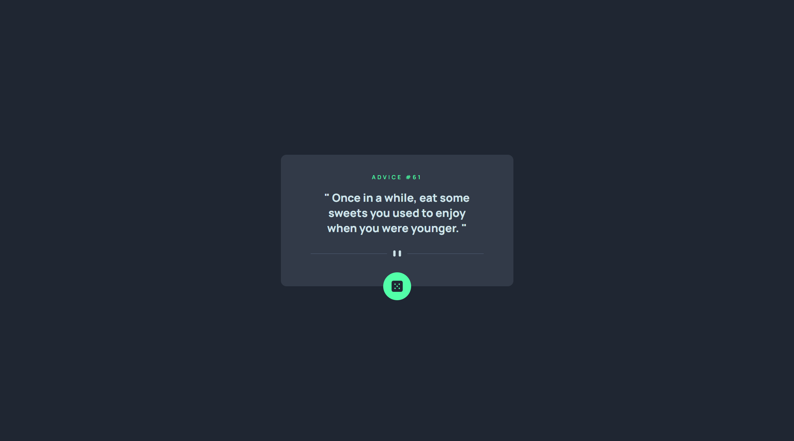

# Frontend Mentor - Advice generator app solution

This is a solution to the [Advice generator app challenge on Frontend Mentor](https://www.frontendmentor.io/challenges/advice-generator-app-QdUG-13db). Frontend Mentor challenges help you improve your coding skills by building realistic projects.

## Table of contents

- [Overview](#overview)
  - [The challenge](#the-challenge)
  - [Screenshot](#screenshot)
  - [Links](#links)
- [My process](#my-process)
  - [Built with](#built-with)
  - [What I learned](#what-i-learned)
- [Author](#author)

**Note: Delete this note and update the table of contents based on what sections you keep.**

## Overview

### The challenge

Users should be able to:

- View the optimal layout for the app depending on their device's screen size
- See hover states for all interactive elements on the page
- Generate a new piece of advice by clicking the dice icon

### Screenshot



**Note: Delete this note and the paragraphs above when you add your screenshot. If you prefer not to add a screenshot, feel free to remove this entire section.**

### Links

- Solution URL: [https://github.com/KH-Ray/advice-generator-app](https://github.com/KH-Ray/advice-generator-app)
- Live Site URL: [https://kh-ray.github.io/advice-generator-app/](https://kh-ray.github.io/advice-generator-app/)

## My process

### Built with

- Semantic HTML5 markup
- asynchronous JavaScript

### What I learned

Use this section to recap over some of your major learnings while working through this project. Writing these out and providing code samples of areas you want to highlight is a great way to reinforce your own knowledge.

To see how you can add code snippets, see below:

```html
<main>
  <div class="container">
    <p class="advice-number">ADVICE #<span class="number"></span></p>
    <h1 class="advice-text"></h1>
    
    <button class="advice-btn">
      
    </button>
  </div>
</main>
```

```css
main {
  display: flex;
  align-items: center;
  justify-content: center;

  background-color: hsl(218, 23%, 16%);
  color: hsl(193, 38%, 86%);
  font-family: "Manrope", sans-serif;
  height: 100vh;
}

.container {
  display: flex;
  align-items: center;
  justify-content: center;
  flex-direction: column;
  gap: 2rem;

  background-color: hsl(217, 19%, 24%);
  border-radius: 12px;
  width: 50rem;
  position: relative;
  padding: 6.4rem;
}

.advice-number {
  color: hsl(150, 100%, 66%);
  font-size: 1.2rem;
  font-weight: 600;
  letter-spacing: 0.4rem;
  margin-top: -2.4rem;
}

.advice-text {
  font-size: 2.4rem;
  font-weight: 800;
  padding: 0 2.4rem 1.2rem;
  text-align: center;
}

.advice-btn {
  display: flex;
  align-items: center;
  justify-content: center;

  position: absolute;
  bottom: -3rem;

  background-color: hsl(150, 100%, 66%);
  border: none;
  padding: 1.8rem;
  border-radius: 100px;

  transition: box-shadow 100ms, transform 100ms;
}

.advice-btn:hover {
  cursor: pointer;
  box-shadow: 0 0 24px hsl(150, 100%, 66%);
  transform: translateY(-2.5px);
}

.advice-btn:active {
  cursor: pointer;
  box-shadow: 0 0 18px hsl(150, 100%, 66%);
  transform: translateY(0);
}

.divider {
  width: 100%;
}
```

```js
const adviceNumber = document.querySelector(".number");
const adviceText = document.querySelector(".advice-text");
const adviceBtn = document.querySelector(".advice-btn");

let res, data;
let id, advice;

const getRandomNumber = function () {
  return Math.floor(Math.random() * 224) + 1;
};

const getAdvice = async function () {
  try {
    res = await fetch(`https://api.adviceslip.com/advice/${getRandomNumber()}`);
    data = await res.json();

    if (!data) throw new Error("Something went wrong when fetching API");

    id = await data.slip.id;
    advice = await data.slip.advice;
  } catch (error) {
    console.error(error);
  }

  adviceNumber.innerText = id;
  adviceText.innerText = `" ${advice} "`;
};

const renderAdvice = function () {
  getRandomNumber();
  getAdvice();
};

adviceBtn.addEventListener("click", function () {
  renderAdvice();
});

window.addEventListener("load", function () {
  renderAdvice();
});
```

## Author

- Frontend Mentor - [@UncertainlySure](https://www.frontendmentor.io/profile/UncertainlySure)
